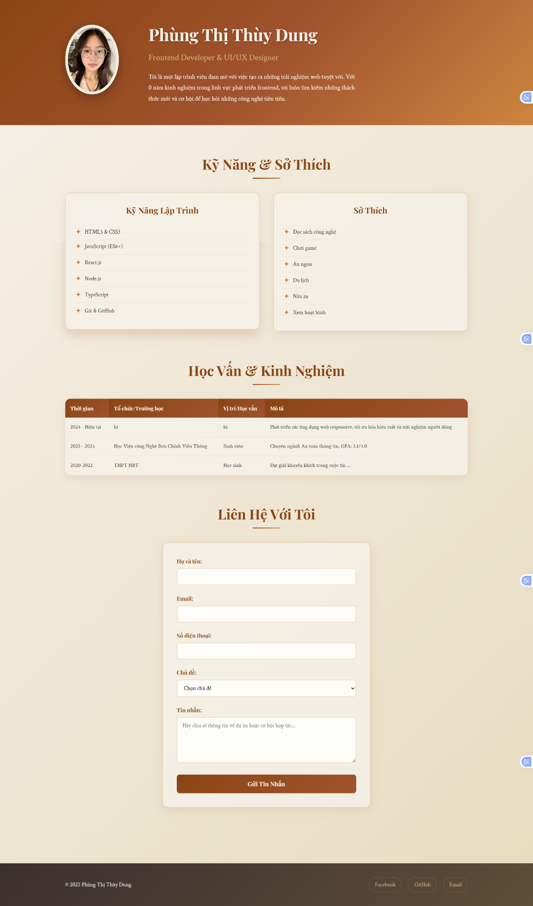

🧾 BÁO CÁO LÝ THUYẾT – GIAI ĐOẠN 3: CSS – LÀM ĐẸP VÀ TẠO LAYOUT TRANG WEB

🔹 Phần 1: CSS Cơ Bản
1. CSS là gì và vai trò
2. Ba cách tích hợp CSS
3. Cú pháp css cơ bản
4. CSS Selectors

🔹 Phần 2: Styling Cơ Bản
1. Typography (Kiểu chữ)
Thuộc tính	  
font-family	    font-size	   font-weight	   color	       text-align	  line-height	   

2. Background & Colors
Thuộc tính	        
background-color	,background-image, background-size	 ,background-position	,background-repeat	

3. Box Model
Mỗi phần tử HTML là một hộp (box) gồm:
margin → border → padding → content

🔹 Phần 3: Layout và Positioning
1. Display Property
Giá trị	                     
block	,inline	 ,inline-block,none	,flex	,grid	                    
table, table-row, table-cel  
contents	                 

2. Positioning

static,relative	,absolute	,fixed, sticky	    

3. Flexbox Layout

2️⃣ Thuộc tính Container:
Thuộc tính	    |Mô tả	                                                |Ví dụ
flex-direction	|Hướng xếp (row, column, row-reverse, column-reverse)	|flex-direction: row;
justify-content	|Căn chỉnh trên trục chính	                            |center, space-between, space-around, space-evenly
align-items	    |Căn trên trục phụ	                                    |center, flex-start, flex-end, stretch
align-content	|Căn chỉnh nhiều hàng (khi có flex-wrap)	            |align-content: space-between;
flex-wrap	    |Cho phép xuống dòng	                                |flex-wrap: wrap;
gap	            |Khoảng cách giữa các item	                            |gap: 20px;

3️⃣ Thuộc tính Item:
Thuộc tính	|Mô tả
order	    |Thay đổi thứ tự hiển thị
flex-grow	|Mức độ giãn khi có không gian trống
flex-shrink	|Mức độ co lại khi thiếu không gian
flex-basis	|Kích thước cơ sở trước khi giãn
align-self	|Ghi đè align-items cho item cụ thể

🔹 PHẦN 4: RESPONSIVE DESIGN (THIẾT KẾ GIAO DIỆN LINH HOẠT)

📘 Cấu trúc cú pháp:
@media (điều_kiện) {
  /* CSS áp dụng khi điều kiện đúng */
}

📙 Ví dụ:
@media screen and (max-width: 768px) {
  body {
    background-color: lightgray;
  }
  h1 {
    font-size: 20px;
  }
}
👉 Khi chiều rộng màn hình ≤ 768px, nền trang sẽ đổi màu và chữ nhỏ hơn.

3️⃣ Các loại Media Query phổ biến
Loại truy vấn	|Mô tả	                                    |Ví dụ
max-width	    |Áp dụng khi kích thước ≤ giá trị chỉ định	|@media (max-width: 768px)
min-width	    |Áp dụng khi kích thước ≥ giá trị chỉ định	|@media (min-width: 1024px)
orientation	    |Theo hướng thiết bị (portrait/landscape)	|@media (orientation: portrait)

🔹 Breakpoints thông dụng:
Thiết bị	            |Kích thước khuyến nghị
Mobile nhỏ	            |≤ 480px
Mobile lớn / Tablet dọc |	481px – 767px
Tablet ngang	        |768px – 1023px
Laptop / Desktop nhỏ	|1024px – 1279px
Desktop lớn	            |≥ 1280px

4️⃣ Responsive Units (Đơn vị responsive)
Đơn vị	|Ý nghĩa	                                |Ví dụ	            |Tính chất
px	    |Đơn vị cố định (pixel)	                    |width: 300px;	    |Không responsive
%	    |Theo tỷ lệ phần trăm phần tử cha           |	width: 50%;	    |Responsive
em	    |Dựa trên font-size của phần tử cha	        |margin: 2em;	    |Tương đối
rem	    |Dựa trên font-size của phần tử gốc (html)	|font-size: 1.2rem;	|Tương đối
vw	    |% chiều rộng màn hình (viewport width)	    |width: 50vw;	    |Rất responsive
vh	    |% chiều cao màn hình (viewport height)	    |height: 100vh;     |Rất responsive

🔹 PHẦN 5: CSS EFFECTS & ANIMATIONS (HIỆU ỨNG VÀ CHUYỂN ĐỘNG)
1️⃣ CSS Transitions (Hiệu ứng chuyển tiếp)

Tạo hiệu ứng mượt mà khi một thuộc tính thay đổi giá trị (ví dụ: hover, focus...).

📘 Cấu trúc:
selector {
  transition: property duration timing-function delay;
}

📙 Ví dụ:
button {
  background-color: blue;
  transition: background-color 0.4s ease;
}
button:hover {
  background-color: red;
}
👉 Khi rê chuột vào, nút chuyển màu mượt trong 0.4s.

🧩 Thuộc tính liên quan:
Thuộc tính	                |Ý nghĩa	                    |Ví dụ
transition-property	        |Chỉ định thuộc tính áp dụng	|background-color
transition-duration	        |Thời gian hiệu ứng	            |0.5s
transition-timing-function	|Đường cong chuyển động	        |ease, linear, ease-in-out
transition-delay	        |Thời gian trễ	                |0.2s

2️⃣ CSS Transforms (Biến đổi phần tử)

Giúp xoay, di chuyển, co giãn hoặc nghiêng phần tử trong không gian 2D/3D.

📘 Ví dụ cơ bản:
.box {
  transform: translate(50px, 20px) scale(1.2) rotate(15deg);
}

🧩 Các hàm transform:
Hàm	            |Mô tả	            |Ví dụ
translate(x, y)	|Di chuyển phần tử	|translate(100px, 0)
scale(x, y)	    |Phóng to/thu nhỏ	|scale(1.5)
rotate(deg)	    |Xoay phần tử	    |rotate(45deg)
skew(x, y)	    |Nghiêng phần tử	|skew(10deg, 0)
matrix(a,b,c,d,e,f)	|Kết hợp nhiều phép biến đổi	Nâng cao

📙 Transform 3D:
transform: rotateY(180deg) translateZ(50px);
transform-style: preserve-3d;

3️⃣ CSS Animations (Hoạt hình CSS)
Giúp tạo chuyển động tự động, lặp lại mà không cần JavaScript.

📘 Cấu trúc:
@keyframes animation-name {
  from { property: value1; }
  to { property: value2; }
}
.selector {
  animation: animation-name duration timing-function delay iteration-count direction;
}

📙 Ví dụ:
@keyframes move {
  0% { transform: translateX(0); }
  50% { transform: translateX(100px); background-color: red; }
  100% { transform: translateX(0); background-color: blue; }
}

.box {
  width: 100px;
  height: 100px;
  background: blue;
  animation: move 3s ease-in-out infinite;
}
👉 Hộp di chuyển qua lại và đổi màu liên tục.

4️⃣ Các thuộc tính animation phổ biến:
Thuộc tính	                |Mô tả	                                                        |Ví dụ
animation-name	            |Tên của keyframes	                                            |move
animation-duration	        |Thời gian chạy 1 chu kỳ	                                    |3s
animation-timing-function	|Độ mượt	                                                   |ease-in-out
animation-delay	            |Thời gian trễ	                                                |1s
animation-iteration-count	|Số lần lặp	                                                    |infinite, 1, 3
animation-direction	        |Hướng lặp (normal, reverse, alternate)	                        |alternate
animation-fill-mode	        |Giữ trạng thái sau khi kết thúc (forwards, backwards, both)	|forwards
animation-play-state	    |Tạm dừng/chạy animation (paused, running)	                    |paused

5️⃣ Hiệu ứng nâng cao thường dùng
Hiệu ứng	    |Mô tả	                    |Thuộc tính chính
Hover effect	|Hiệu ứng khi rê chuột	    |:hover, transition, transform
Fade in/out	    |Mờ dần xuất hiện/biến mất	|opacity, animation
Slide in/out	|Trượt từ cạnh màn hình	    |transform: translate()
Pulse / Bounce	|Nhịp đập, nảy lên	        |@keyframes, scale()
Button glow	    |Nút phát sáng	            |box-shadow, transition
Card hover zoom	|Phóng to nhẹ khi hover	    |transform: scale(1.05)

🔹Phần 6: Thực hành
1️⃣ Styling lại trang Profile từ tuần 1

2️⃣ Tạo trang Portfolio đơn giản
.png>)

🔹Phần 7: Ôn lại react cơ bản 
- cấu trúc 
- component 
- cách truyền props
- event
- useState

